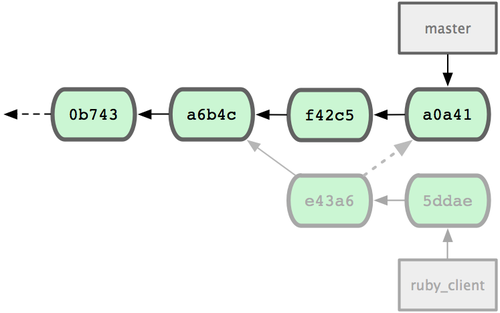

!SLIDE
# Problem
## You want a commit from another branch

!SLIDE
## `git cherry-pick`

!SLIDE bullets incremental
## Common options

* `-e, --edit`
* `-n, --no-commit`
* `-s, --signoff`

!SLIDE bullets incremental
## Sequencers

* `--continue`
* `--quit`
* `--abort`

!SLIDE
## Example

!SLIDE center

!SLIDE commandline smaller

    $ git cherry-pick e43a6fd3e94888d76779ad79fb568ed180e5fcdf
    Finished one cherry-pick.
    [master]: created a0a41a9: "More friendly message when locking the index fails."
     3 files changed, 17 insertions(+), 3 deletions(-)

!SLIDE center

!SLIDE center
## 5.3 Distributed Git - Maintaining a Project
### http://git-scm.com/book/en/Distributed-Git-Maintaining-a-Project

