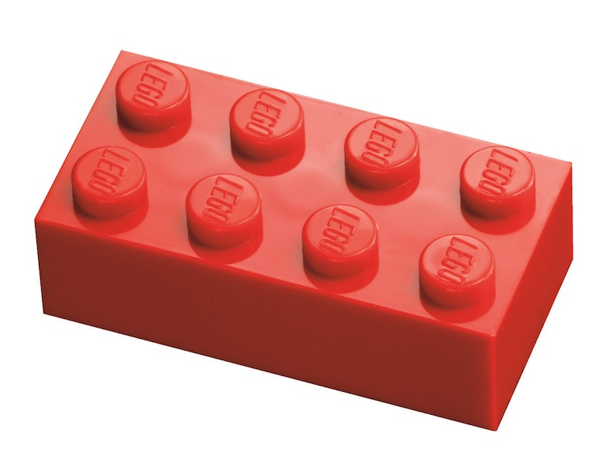

!SLIDE
# Problem
## You have many commits; you want one

!SLIDE
## `git rebase --interactive`

!SLIDE
## Step-by-step

!SLIDE bullets incremental
## Sequencers

* `--continue`
* `--skip`
* `--abort`

!SLIDE center

!SLIDE
## Demo
### Squashing WIPs
